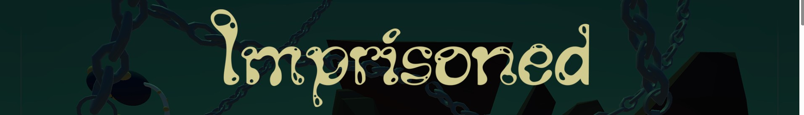
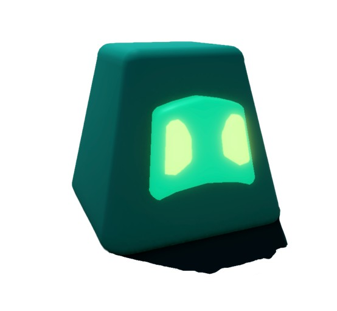

  

# Imprisoned

**A dark 2D adventure about escaping captivity and surviving a hostile world.**

  

## The Story

You wake up in a place you don’t remember entering.  
The halls are silent, the air feels heavy, and something is very wrong.

There is no explanation.  
No guide.  

Only one clear objective:

**Get out.**

Explore the environment, avoid dangers, and uncover a path to freedom -  
if one exists.

---

## How to Play

  

You control a small **gel creature** with a unique ability:  
it stretches across the environment and **captures territory**.

When the creature **closes a shape**, it activates its special power - 
damaging enemies trapped inside the captured area.

But be careful.

Your **size is your life**.

Stretching across the world consumes mass, so collect **gel fragments** scattered throughout the environment to grow stronger and survive longer.

### Controls
- Arrow Keys - Move  
- Game Controller - Supported

---

## Technologies
Unity • C# • Git

---

## Credits

**Programming**  
Shir Seroussi, Eden Avrahami, David Deitch  

**Art & Design**  
Ksenia Spirina, Ohad Lerman  

Created as part of the **Game Lab course**  
at **Bezalel Academy of Arts and Design**.

---

🎮 **Play the game:**  
https://ksenia-spirina.itch.io/imprisoned
